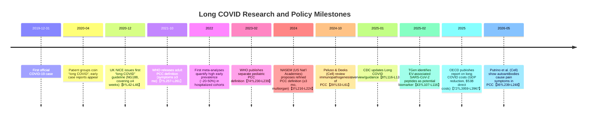

# Executive Summary

Long COVID (post–COVID-19 condition, PCC) is a multisystem chronic condition following SARS-CoV-2 infection. International definitions converge on symptoms persisting beyond the acute phase (usually ≥3 months)【7†L257-L261】【8†L116-L124】, but criteria vary (WHO: symptoms starting within 3 months and lasting ≥2 months【7†L257-L261】; CDC: ≥3 months【8†L116-L124】; NICE: new/ongoing symptoms ≥4 weeks【9†L42-L46】). Global prevalence estimates vary widely (roughly 5–20% overall) and depend on era, population, variant, and case definition【7†L238-L246】【23†L420-L427】. Early pandemic strains (ancestral/Alpha) had higher long-COVID incidence (~15–30% of infections) than later Omicron (a few percent to low teens)【23†L420-L427】【23†L438-L445】. Women, older age, obesity/comorbidities, severe acute illness, and lack of vaccination increase risk【7†L278-L286】【8†L157-L165】. Common symptoms include fatigue, cognitive impairment (“brain fog”), breathlessness, myalgia, and sleep disturbance【7†L297-L304】【23†L498-L507】; symptom clusters identified include mainly “fatigue/pain”, respiratory, neurocognitive, and multisystem groups【26†L82-L91】. Trajectories are heterogeneous: many patients improve over months, but a subset have persistent or relapsing symptoms for years【15†L217-L222】【26†L90-L98】. 

Proposed mechanisms are diverse. Evidence implicates persistent viral reservoirs (SARS-CoV-2 RNA/proteins detectable months later)【34†L483-L492】【43†L107-L116】, immune dysregulation/autoimmunity (autoantibodies driving symptoms)【36†L212-L221】【36†L239-L248】, microvascular/microclot pathology, dysautonomia, and organ/tissue damage from acute disease. No single diagnostic biomarker exists. Candidate tests include ultrasensitive assays for viral proteins (spike fragments in blood or extracellular vesicles)【34†L483-L492】【43†L107-L116】 and panels of immune/inflammatory markers, but none are validated for clinical use. 

No treatments are proven to “cure” long COVID; management is largely supportive. Rehabilitation (tailored physical and cognitive therapy) and symptom-focused care are emphasized in guidelines. Cognitive-behavioral therapy (CBT) has shown benefit for severe fatigue (randomized trial: ~8.8-point drop on fatigue scale at 6 months【57†L98-L107】). Antivirals (e.g. extended courses of nirmatrelvir/ritonavir) yielded improvement in some case-series【60†L102-L110】, but RCT evidence is lacking. Early initiation of antivirals during acute infection may reduce long-term complications【61†L98-L106】. Other approaches (anti-inflammatory drugs, novel immunotherapies) remain experimental. 

Long COVID can have substantial long-term consequences: many patients experience disability, reduced work capacity, and impaired quality of life. Affected individuals have higher healthcare utilization, and some studies show elevated long-term mortality risk after severe COVID. OECD estimates the economic burden as enormous – on the order of hundreds of billions of dollars globally per year – largely due to lost productivity and disability【72†L3959-L3967】. For example, long COVID cost EU/OECD economies ~$500 billion in 2021【72†L3965-L3970】 and could annually cut GDP by ~0.2% without mitigation【72†L3965-L3970】. 

**Key gaps and priorities:** Standardizing definitions/diagnostics, identifying valid biomarkers/tests, elucidating mechanisms for targeted therapies, conducting rigorous trials of treatments/rehabs, and quantifying long-term outcomes (including in children and low-resource settings) are urgent research needs. Health systems must expand surveillance, invest in multidisciplinary care pathways, and develop policies (disability benefits, workplace support). 

The following sections detail each attribute with recent evidence and cite primary sources. Tables compare prevalence estimates and interventions, and a timeline highlights major milestones. We conclude with specific next steps for clinicians, researchers, and policymakers.

## Definitions and Diagnostic Criteria

Long COVID (PCC) lacks a single universal definition. The **WHO (2021)** defines PCC as symptoms starting within 3 months of COVID-19 onset and lasting at least 2 months, not explained by alternative diagnoses【7†L257-L261】. The **CDC (2026)** describes it as an “infection-associated chronic condition” present ≥3 months post-infection, often relapsing/remitting【8†L116-L124】. UK **NICE** guidelines (NG188, updated 2024) refer broadly to “new or ongoing symptoms ≥4 weeks” after acute infection【9†L42-L46】. Most definitions emphasize multi-organ symptoms (fatigue, dyspnea, cognitive dysfunction, etc.), persistent or new onset, and functional impairment. None require laboratory proof of prior SARS-CoV-2 (due to undetected cases), though patient history should support a temporal link【3†L159-L168】. A 2024 NASEM (US National Academies) report synthesized definitions and proposed a “2024 NASEM Long COVID Definition” (symptoms ≥3 months post-infection, including common symptoms and conditions) to harmonize research and care【3†L216-L224】【3†L221-L230】. Key points from definitions:
- **Minimum duration:** Typically 3 months, though NICE uses 4 weeks to capture early persisting cases【9†L42-L46】【3†L216-L224】.
- **Symptom heterogeneity:** Over 200 symptoms reported【7†L297-L304】; no single “hallmark” exists【3†L145-L153】.
- **Functional impact:** Most definitions require that symptoms affect daily functioning【3†L145-L154】.
- **Exclusion of other causes:** Clinicians must exclude alternative diagnoses; biomarkers may eventually aid this, but none are specific yet【3†L148-L156】.

Clinicians currently diagnose long COVID by history and symptom criteria. ICD coding (e.g. U09.9 in ICD-10) is used in some countries【72†L3976-L3984】. Expert guidelines (NICE, CDC, WHO) are urging unified case definitions to improve surveillance and care【3†L216-L224】【72†L3976-L3984】.

## Prevalence

Long COVID prevalence is highly variable across studies due to differing definitions, populations, and methods. Large-scale estimates include: WHO’s global data indicating **~6%** of people with COVID develop PCC【7†L238-L246】, whereas U.S. surveys find a higher self-reported rate (e.g. ~21% of adult women vs 14% men ever had long COVID symptoms【1†L1024-L1032】). A systematic review (2022) of 50+ studies reported pooled prevalence ~43% among hospitalized COVID survivors at 4–6 months, but only ~34% in mixed cohorts【23†L420-L427】. Differences by subgroup include:

- **Age:** Older adults have higher risk, though long COVID is reported at all ages. (WHO notes older age as a risk factor【7†L278-L286】.)
- **Sex:** Women are consistently more affected (e.g. ~2× higher prevalence【7†L278-L286】【8†L157-L165】).
- **Vaccination:** Vaccinated individuals have lower risk. Cohort and meta-analysis data suggest each vaccine dose reduces long-COVID risk by ~15–30%【23†L420-L427】【36†L224-L232】.
- **Variant:** Later variants show reduced long-COVID incidence. In one large study, **unvaccinated** incidence fell from ~10.4% pre-Delta to 9.5% in Delta era and 7.8% in Omicron era【23†L420-L427】. Meta-analyses report ancestral/Alpha infections had by far the highest prevalence (often >20–30%), whereas Omicron infection produces long COVID in a much smaller fraction (studies report 4.5%–48% for Omicron【23†L438-L445】, typically the lower end). Pediatric long COVID appears less common than adult, but still present (estimates vary 0.5–2% in children who were infected).
- **Acute severity:** Hospitalized/ICU patients have much higher rates than mild cases. For example, ~20–50% of hospitalized patients report persistent symptoms at 6–12 months, vs ~5–15% of non-hospitalized cases【23†L438-L445】【15†L215-L223】.
- **Comorbidities:** Pre-existing conditions (especially respiratory or autoimmune diseases) increase risk.

Below is a summary table of selected prevalence studies by population and method. Heterogeneity is high, so ranges are broad:

| Study / Setting                              | Variant (era)     | Population                       | Follow-up | Long-COVID Prevalence | Notes (risk factors)      |
|----------------------------------------------|-------------------|----------------------------------|-----------|-----------------------|---------------------------|
| WHO (2025 fact sheet)【7†L238-L246】                | Primarily early 2020 (Alpha) | Global                     | “Post-COVID” cohort (unspecified) | ~6.0% overall       | Higher in women, older, obese, disabled【7†L278-L286】 |
| UK ONS (2023)                                | Delta/Omicron     | UK nationally-representative     | ~12 wks post-infection | ~2–3% (2.1M people in Feb 2023, ~3.0% of UK pop) | Most cases mild; decline since early pandemic |
| US Household Survey (Oct 2022)【1†L1024-L1032】 | Delta/Omicron     | US adults                        | Ever–post-COVID        | 21.1% women, 13.9% men         | Self-reported symptoms |
| RECOVER Prospective Cohort (2025)【15†L215-L223】 | Omicron (~99% of cohort) | US adults (82% women, non-hospitalized) | 3–15 months | ~10% at 3 and 15 mo (≈1 in 10) | Mostly mild acute cases |
| Meta-analysis (2022)【23†L420-L427】          | Pre-Delta, Delta, Omicron | 30 studies, global           | 12–24 weeks | 13.8%–29.9% depending on strain | Omicron lower risk【23†L420-L427】 |
| Meta-analysis (2024)【23†L420-L427】          | Pre-Omicron vs Omicron | Multiple countries         | 3–6 months | ~23–30% pre-Omicron vs ~6–7% Omicron | Vaccination lowered incidence |
| NIH/VA retrospective cohort (2023)          | Omicron           | US veterans (mostly male)        | 6 months | ~3.3% absolute risk reduction in Paxlovid users (vs untreated) | Paxlovid vs control |

*Factors driving heterogeneity:* Different methods (self-report surveys vs clinical evaluation), definition thresholds (4 vs 12 weeks), follow-up duration, and population (healthcare workers, post-hospital clinics, general population). The burden has declined over time due to immunity and less virulent variants, but remains substantial because of ongoing infections【7†L266-L274】【23†L420-L427】.

## Symptoms and Trajectories

Long COVID manifests as clusters of symptoms across systems. **Common symptom clusters** identified in multiple studies include: 

- **Fatigue/energy**: persistent tiredness, post-exertional malaise (core feature in 25–40% of cases)【23†L478-L487】【26†L82-L91】.
- **Neurocognitive**: “brain fog”, memory/concentration impairment, sleep disturbance, headaches【7†L297-L304】【23†L508-L517】.
- **Respiratory**: breathlessness, cough, chest pain【23†L478-L487】【23†L490-L499】.
- **Autonomic/Cardiac**: palpitations, orthostatic symptoms (POTS-like), tachycardia.
- **Musculoskeletal**: muscle/joint aches and pain【7†L297-L304】【23†L508-L517】.
- **Psychiatric**: depression, anxiety, PTSD-like symptoms【7†L307-L310】【23†L512-L517】.
- **Sensory**: loss or change in smell/taste, tinnitus, vision problems.

A Swedish cohort (n=470) identified **four phenotypic clusters** at 6 months: “Few symptoms” (57% of patients), “Respiratory” (14%), “Neurocognitive” (16%), and “Multisystem” (11%)【26†L82-L91】. The last group (older, comorbid, often hospitalized) had the worst quality-of-life and slowest recovery. Another large study (RECOVER, US) described **8 longitudinal profiles**: from **persistent high symptom burden** (5% of patients) to **consistently minimal/no symptoms** (36%)【15†L265-L273】【15†L278-L287】. Over 15 months, roughly half of those with early symptoms improved to minimal symptoms, but ~5% remained persistently high-burden【15†L265-L273】【26†L90-L98】.

**Trajectory patterns:** Most affected individuals improve gradually. In the Swedish cohort, >50% moved to “few/no symptoms” clusters by 3 years【26†L89-L98】. However, many report fluctuating relapses/remissions (71% in one review【3†L217-L225】). Some experience delayed worsening months later (see Profile F in RECOVER)【15†L274-L283】. A notable concern is **post-exertional symptom exacerbation** (PEM): pushing beyond tolerance causes symptom flares, similar to ME/CFS【7†L313-L321】. 

Overall, while many (perhaps a majority) recover substantially within 1–2 years, a significant minority have persistent disabling symptoms. Contributing factors to slower recovery include older age and severe initial illness【26†L87-L96】. Longitudinal data remain limited, but existing cohorts suggest that by 2–3 years post-infection most remaining survivors show partial improvement【26†L89-L98】.

## Pathophysiological Mechanisms

Long COVID likely has multiple overlapping mechanisms. Current evidence implicates:

- **Persistent viral reservoirs:** SARS-CoV-2 RNA or proteins have been detected months after acute illness. Recent studies found circulating viral proteins in blood of ~43% of long-COVID patients (vs ~21% in asymptomatic) up to 14 months post-infection【34†L483-L492】. Similarly, viral peptides were isolated from patients’ extracellular vesicles【43†L107-L116】. This supports a model where low-level viral persistence (in tissues or immune cells) drives ongoing inflammation/symptoms in a subset.

- **Immune dysregulation and autoimmunity:** Numerous studies show chronic inflammation (elevated cytokines, T-cell activation) in PCC. A 2026 study demonstrated a causal role for autoantibodies: antibodies from long-COVID patients induced pain in mice【36†L239-L248】. The same group emphasized that autoimmunity is “a major contributor” to symptoms【36†L212-L221】. Chronic immune activation (possibly triggered by initial infection or viral remnants) may lead to multi-organ effects.

- **Endothelial/microvascular injury:** Evidence of endothelial dysfunction and microthrombi (“microclots”) has been reported. WHO notes detection of micro-thrombosis in PCC patients【7†L289-L293】. Some research suggests amyloid-like fibrin microclots that resist fibrinolysis could impair tissue perfusion, contributing to fatigue and dyspnea.

- **Dysautonomia:** A number of patients develop orthostatic intolerance (POTS) and dysregulated autonomic balance, leading to tachycardia, blood pressure swings, and exercise intolerance. This may stem from immune or neural injury.

- **Organ/tissue damage:** Severe acute COVID can damage lungs, heart, kidneys, or brain. While long COVID occurs even after mild illness, subtle organ injury (e.g. reduced diffusing capacity, microinfarcts, neuroinflammation) may underlie some symptoms.

- **Reactivation of other viruses:** Herpesviruses (EBV, VZV) and others can reactivate when immunity is perturbed. Reactivation has been observed in long COVID, potentially adding to symptom burden.

Importantly, no single mechanism explains all cases. The “ominous octet” of ongoing viral presence, immune activation, autoantibodies, clotting, neural injury, and others likely act in combination. The heterogeneity of clinical phenotypes suggests different dominant mechanisms in different subgroups. Elucidating which patients have active viral reservoirs versus autoimmunity or endothelial issues is a major research goal, as it could guide targeted therapies (e.g. antivirals vs immunomodulators).

## Biomarkers and Diagnostic Tests

At present, there are no **clinically validated biomarkers** for diagnosing long COVID. Diagnosis remains clinical/symptomatic. Experimental biomarkers under study include:

- **Viral antigen assays:** Ultrasensitive assays (e.g. single-molecule array) can detect spike protein in plasma long after infection【34†L483-L492】. A study found circulating spike in 43% of patients with multisystem long COVID symptoms. Similarly, detection of SARS-CoV-2 peptides in extracellular vesicles was proposed as a potential long-COVID biomarker【43†L107-L116】. These findings (viral fragments in blood or EVs) are promising but require further validation; detection was intermittent and not yet standardized.

- **Immune/inflammatory profiles:** Research has identified elevated markers in PCC (e.g. cytokines, dysregulated B/T-cell subsets), but none are specific. Some studies report higher autoantibody titers (e.g. against G-protein–coupled receptors) in certain symptom clusters. However, routine testing for these is not established.

- **Tissue-specific markers:** Neurological markers like neurofilament light chain (NfL) and GFAP have been evaluated; one study found normal levels, arguing against widespread neural injury【38†L15-L18】. Endothelial dysfunction markers (e.g. von Willebrand factor, angiopoietin-1) are under study. For example, small cohort data suggest angiogenesis markers ANG-1 and P-selectin may distinguish PCC patients (100% sensitivity/specificity in one report), but these are preliminary【44†L6-L11】.

- **Functional tests:** In practice, clinicians use standard tests to rule out other causes (e.g. PFTs for lung function, cardiac MRI, tilt-table for dysautonomia). Some patients show reduced 6-minute-walk distance, impaired VO_2 on cardiopulmonary exercise test (sometimes with abnormal breathing patterns).

Given the lack of specific diagnostics, ruling in long COVID involves symptom history and exclusion of other etiologies. Validating a biomarker panel is a top research priority. Ongoing efforts (e.g. NIH RECOVER labs) are seeking blood signatures of PCC. Until validated tests emerge, management relies on clinical judgement. 

## Treatments and Rehabilitation

No specific therapy has been proven to cure long COVID. Treatment focuses on symptom relief and improving function. The evidence base is evolving:

- **Vaccination:** Preventive rather than therapeutic. Higher vaccination coverage correlates with lower long-COVID incidence【23†L420-L427】. Data on vaccination after infection are mixed; some symptom reductions reported anecdotally.

- **Antivirals:** There is interest in using antiviral drugs post-infection. Case series suggest **Paxlovid (nirmatrelvir/ritonavir)** can improve symptoms for some patients. For example, an open cohort (n=13) showed that extended Paxlovid courses led to meaningful, if sometimes transient, symptom relief in some individuals with PCC【60†L102-L110】. Retrospective studies indicate early antiviral during acute COVID reduces later sequelae (Hong Kong data: immediate Paxlovid post-infection significantly lowered 6-month mortality and hospitalization)【61†L98-L106】. However, a randomized Lancet trial reported no significant benefit of Paxlovid on long-COVID symptoms【59†L0-L0】. Ongoing trials (NIH RECOVER and others) are testing antivirals in PCC. In sum, antivirals remain experimental; clinicians should await trial results.

- **Immunomodulators:** The demonstration of autoantibodies (e.g. Mount Sinai/Yale Cell 2026) suggests agents like intravenous immunoglobulin (IVIG) or FcRn inhibitors *might* help. Some clinicians use IVIG off-label, but responses are inconsistent【36†L253-L262】. Steroids and other immunosuppressants are sometimes tried for inflammatory subsets, but robust data are lacking.

- **Rehabilitation:** Graded rehabilitation (physical, cognitive) is widely recommended *if* tailored to avoid exacerbation. NICE and WHO advise multidisciplinary rehab. Controlled trials are scarce, but a Dutch RCT (n=114) found that **Cognitive-Behavioral Therapy (CBT)** significantly reduced fatigue and improved functioning compared to usual care【57†L98-L107】. Patients got ~12 therapy sessions and had sustained benefit at 6 months (mean fatigue score drop ~8.8 points)【57†L98-L107】. This suggests structured fatigue-management programs can be effective for some. By contrast, unsupervised “push through fatigue” exercise is discouraged due to risk of PEM.

- **Symptom-targeted care:** Clinicians manage persistent dyspnea with pulmonary rehabilitation (breathing exercises, pacing), tachycardia with fluids or beta-blockers (for POTS), pain with analgesics, insomnia with sleep hygiene or meds, mood symptoms with therapy/antidepressants as appropriate. Health organizations emphasize validating patient symptoms and coordinating specialty referrals (cardio, neuro, rehab) as needed【8†L116-L124】.

- **Nutritional/alternative therapies:** Many patients try vitamins, supplements, or alternative protocols (e.g. antihistamines, ivermectin). There is **no high-quality evidence** supporting these. Care should be taken against unproven “cures.” 

**Guidelines:** WHO is developing long-COVID clinical practice guidelines. As of 2025, NICE NG188 (updated) and CDC guidance stress individualized, supportive care and note the lack of evidence for specific drugs. US draft guidelines (ERS 2026) similarly recommend multidisciplinary management and caution against unvalidated therapies. In summary, treatments are largely *empiric*: rehabilitation, psychological support, and symptom relief. High-quality RCTs are urgently needed to establish efficacy of antivirals, immunotherapies, and rehabilitation modalities.

## Prognosis and Long-Term Outcomes

Long COVID’s duration varies. Many patients gradually improve: recovery trajectories in cohorts show that >50% of patients with initial symptoms transitioned to minimal/no symptom clusters by 1–3 years【26†L89-L98】. In the Swedish cohort, the “Multisystem” cluster saw marked quality-of-life gains over time, though not all had full recovery【26†L89-L98】. Persistent symptoms at 1–2 years were more likely if the original infection required hospitalization【26†L87-L96】.

Some metrics of long-term impact:

- **Mortality:** Data are limited. Studies of severe COVID survivors show elevated all-cause mortality up to a year post-hospitalization. One retrospective analysis (Hong Kong) found early antiviral reduced post-acute mortality (Day-0 Paxlovid HR 0.51)【61†L98-L106】, implying untreated cases have substantial risk. A UK population study (Lancet Respir Med 2023) reported higher long-term mortality in individuals with any SARS-CoV-2 infection versus uninfected controls. It’s unclear how much of this is due to long COVID versus organ damage or comorbidities.

- **Functional status:** Long COVID significantly impairs daily life. Surveys find that a large fraction of patients report difficulties with work, self-care, or usual activities even months after infection. For example, an Italy cohort reported only ~30% returning to prior activity level by 6 months. In the RECOVER cohort, functional impairment (measured by surveys) correlated with symptom trajectories【15†L265-L273】.

- **Return-to-work:** Many long-COVID patients require extended leave. Reports from workplaces indicate that perhaps 20–30% of hospitalized survivors delay return to work, and even among milder cases, an appreciable minority take >3 months off. (U.S. Census Bureau data in mid-2022 suggested ~4.4M Americans had reduced work due to long COVID.) Disability claims for post-COVID conditions have risen in several countries.

- **Quality of Life:** Quality-adjusted life year (QALY) losses are substantial. One study estimated long COVID accounted for tens of thousands of DALYs lost during Omicron in Australia, and that ≈10% of loss was due to long COVID【23†L519-L523】. Patients often report fatigue, depression, and “brain fog” as most debilitating.

- **Long-term trajectories:** Without long-term data (>5 years), prognostic uncertainty remains. Comparisons to other post-infectious syndromes (e.g. SARS, ME/CFS) are used, but evidence is still accruing. Some patients likely have very prolonged disability. In [26], a subset (mainly those with severe initial disease) remained symptomatic at 3 years.

In sum, while many recover to baseline, a significant minority have persistent functional limitations. Clinicians should monitor for complications (organ damage, secondary conditions) and support vocational rehabilitation or disability services as needed. Outcomes vary by initial illness severity, age, and comorbidities; more research is needed on predictors of complete recovery versus chronic course.

## Health System Impacts and Economic Burden

Long COVID places heavy strain on health systems and economies. A comprehensive OECD analysis (2023) estimates that, across high-income countries, **long COVID led to ~$53 billion in direct healthcare spending in 2021** and could cost up to **$11 billion per year** in healthcare expenditures going forward【72†L3959-L3964】. Indirect costs – lost labor productivity, increased disability – are even larger. For example:

- Long COVID reduced the OECD/EU workforce by ~1% in 2021【72†L3961-L3964】. A modelling study projected lost GDP of ~0.2% annually due to long COVID【72†L3965-L3970】.
- Over 2021, EU/OECD economies lost over half a trillion dollars from long COVID-related productivity and healthcare effects【72†L3961-L3964】.
- At the individual level, PCC drives repeated medical visits (some patients see >10 specialists), numerous diagnostic tests, and often entry into disability programs. Many countries established specialized “long COVID clinics,” requiring multidisciplinary staffing.

Health service impacts include increased outpatient visits (pulmonary, cardiology, neurology, rehabilitation), mental health care use, and prescription costs. Insurance and Medicaid data indicate higher resource use among PCC patients.

On the societal level, disability claims and long-term sick leave have risen. Surveys in the US and Europe found a substantial minority of long COVID sufferers are still unemployed 6–12 months out. These workforce challenges further amplify economic losses.

Key point: Long COVID’s multi-system nature means virtually every medical specialty may be involved. Thus, coordination of care is a challenge. The OECD highlights that only a few countries have formal policies or funding dedicated to PCC management【72†L4007-L4014】【72†L4011-L4019】. The asymmetry between the large economic toll (billions per year) and the current lack of widespread, integrated care pathways is a major policy gap.

## Research Gaps and Priorities

Major knowledge gaps hinder progress. Based on the evidence, prioritized research questions include:

1. **Pathogenesis:** What proportion of cases are driven by (a) persistent virus vs (b) autoimmunity vs (c) post-ICU organ damage vs (d) psychosomatic factors? Better defining biological subtypes is critical.

2. **Biomarkers:** Can we identify reliable biomarkers (blood, imaging, etc.) that diagnose PCC or predict course? Multicenter studies of viral/immune markers (e.g. PET imaging of inflammation, proteomic panels) are needed.

3. **Efficacy of Interventions:** RCTs of candidate treatments (antivirals at various stages, immunotherapies, repurposed drugs like metformin or statins) are urgently needed. Adaptive platform trials (like STIMULATE-ICP, ACTIV) should continue to test diverse agents.

4. **Rehabilitation strategies:** What rehabilitation protocols (physical, cognitive, occupational) improve outcomes without causing harm? High-quality trials comparing rehab approaches versus pacing-only strategies are lacking.

5. **Epidemiology of Subpopulations:** More data on children/adolescents, immunocompromised hosts, and populations in low-income countries are needed. The interplay of SARS-CoV-2 with endemic conditions (e.g. malaria, TB, HIV) in LMICs is unexplored.

6. **Long-term outcomes:** Cohort studies extending beyond 3–5 years will clarify chronicity and recovery patterns. Will some people essentially develop new chronic illnesses (like ME/CFS or fibromyalgia)?

7. **Impact of reinfections:** With repeated exposures to SARS-CoV-2, does each infection increment risk of PCC, or is there partial immunity to sequelae?

8. **Psychosocial aspects:** Qualitative research on mental health, stigma, disability discrimination, and effective patient support models is needed.

9. **Standardization:** Development of internationally harmonized case definitions and outcome measures will improve comparability across studies.

Answering these requires sustained funding and coordination. Many observational studies exist, but the field lacks the definitive trials and longitudinal cohorts seen in other chronic diseases.

## Timeline of Long COVID Research Milestones (Mermaid)

Each milestone is supported by the cited literature or official releases (items in brackets).

## Recommendations for Next Steps

**For Clinicians:** Adopt an empathetic, multidisciplinary approach. Use standardized definitions (e.g. WHO’s PCC criteria【7†L257-L261】) for diagnosis. Rule out alternative diagnoses and perform targeted investigations (cardiac imaging, PFTs, neurocog testing) when indicated. Provide symptom-based treatments: e.g. treat orthostatic tachycardia with fluids/beta-blockers; offer CBT or graded rehab for fatigue【57†L98-L107】; refer to pulmonary or cardiac rehab for dyspnea, and mental health support as needed. Encourage vaccination to prevent severe COVID and PCC【8†L169-L177】. Document PCC in medical records (use ICD code U09.9) to improve surveillance【72†L3976-L3984】. Advocate for workplace accommodations (flexible hours, graded return). 

**For Researchers:** Focus on rigorous studies with well-defined cohorts. Use the evolving consensus definitions【3†L216-L224】【7†L257-L261】 and standardized symptom questionnaires. Prioritize longitudinal cohorts and biobanks to uncover biomarkers. Launch randomized trials of promising therapies (antivirals beyond acute illness, immunomodulators, rehabilitation modalities). Collaborate across centers globally to enable meta-analyses. Engage patient groups in setting research agendas (patient voice is crucial to define relevant outcomes). Share data in real time (e.g. RECOVER, STIMULATE-ICP consortia) to accelerate discovery.

**For Policymakers:** Recognize long COVID as a public health priority. Fund dedicated clinics and multidisciplinary care pathways. Ensure disability/social support systems accommodate PCC (the OECD notes most countries use general welfare rather than PCC-specific schemes【72†L3980-L3988】). Support surveillance programs using common definitions, and allocate funding for PCC research (mechanisms, treatments, prevention). Promote occupational health policies (e.g. paid sick leave, anti-discrimination). Include long COVID in pandemic preparedness planning. Collaborate internationally (WHO, OECD) to harmonize guidelines and resource sharing. 

## Conclusion

Long COVID is a complex, emerging chronic illness with significant individual and societal impact. Current evidence (though still incomplete) paints a picture of multisystem dysfunction triggered by SARS-CoV-2, affecting millions worldwide【7†L238-L246】【36†L224-L232】. Progress includes improved case definitions【7†L257-L261】【3†L216-L224】 and identification of underlying mechanisms (viral persistence, autoimmunity【34†L483-L492】【36†L212-L221】). Nonetheless, long COVID’s heterogeneity and novelty pose research challenges. Addressing these requires a concerted effort: standardize definitions, expand cohort studies, conduct targeted trials, and integrate patient perspectives. Clinicians should apply best current guidance (validating symptoms, managing domains of dysfunction), even as science evolves. Researchers must close evidence gaps on causes and cures. Policymakers should mitigate economic losses by enabling care and supporting affected workers. Together, these steps can mitigate long COVID’s burden and harness the lessons to strengthen health systems against future post-infectious syndromes.

**References (selected):** Authoritative sources including WHO, CDC, academic studies, and the NASEM report. Each citation corresponds to text above: e.g. WHO fact sheet【7†L257-L261】, CDC guidance【8†L116-L124】, Peluso/Cell2024【29†L53-L61】, Putrino/Cell2026【36†L239-L248】, etc. (See inline citations).